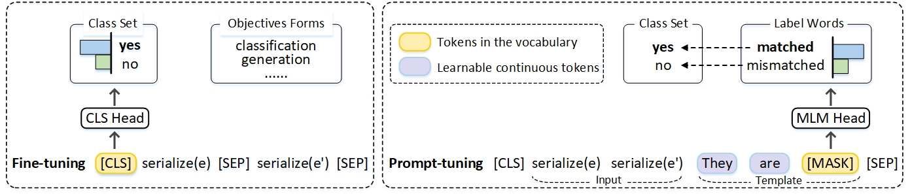

# PromptEM: Prompt-tuning for Low-resource Generalized Entity Matching

PromptEM is a novel low-resource GEM (Generalized Entity Matching) solution powered by prompt-tuning and self-training. To address the gap between pre-training and fine-tuning, we cast GEM as a cloze-style task and design the GEM-specific prompt-tuning, which can stimulate the rich knowledge distributed in LMs. To select high-quality pseudo-labels, we develop a lightweight uncertainty-aware self-training method to boost performance. To further avoid expensive self-training, we prune useless training data dynamically using the proposed MC-EL2N, making the self-training process more lightweight and efficient. 

For more technical details, see [PromptEM: Prompt-tuning for Low-resource Generalized Entity Matching](https://arxiv.org/pdf/2207.04802.pdf).



## Datasets

We use eight real-world benchmark datasets with different structures from [Machamp](https://github.com/megagonlabs/machamp) and [Geo-ER](https://github.com/PasqualeTurin/Geo-ER).

## Quick Start

To train and evaluate with PromptEM.

```
python main.py [<args>] [-h | --help]
```

e.g.

```
python main.py -d=rel-heter -k=0.1 -st -dd=8 -ur=0.05 -er=0.05
```

The meaning of the flags:

- `--model_name_or_path`: the name or local path of the pre-trained language model. e.g. `roberta-base`
- `--data_name`: the name of the dataset. options: `[rel-heter, rel-text, semi-heter, semi-homo, semi-rel, semi-text-c,semi-text-w, geo-heter, all]`
- `--k`: the proportion of training data used. e.g. `0.1`
- `--num_iter`: the number of iterations. e.g. `1`
- `--template_no`: the number of templates used in PromptEM. options: `[0,1,2,3]`
- `--self_training`: the flag to enable self-training of PromptEM.
- `--dynamic_dataset`: the frequency of dynamic dataset pruning. e.g. `8` (pruning for every 8 epochs)
- `--pseudo_label_method`: the method of generating pseudo labels. e.g. `uncertainty`
- `--mc_dropout_pass`: the number of MC-Dropout passes. e.g. `10`
- `--uncertainty_ratio`: the proportion of the unlabeled samples for generating pseudo labels. e.g. `0.05`
- `--el2n_ratio`: the proportion of the labeled samples for dynamic dataset pruning.  e.g. `0.1`
- `--text_summarize`: the flag to enable text summarization in entity serialization.
- `--add_token`: the flag to add special token in entity serialization.
- `--max_length`:  the maximum length (in number of tokens) for the inputs to the transformer model. e.g. `512`
- `--teacher_epochs`: the number of epochs for training teacher model. e.g. `20`
- `--student_epochs` : the number of epochs for training student model. e.g. `30`
- `--batch_size`: batch size. e.g. `32`
- `--lr`: learning rate. e.g.`1e-5`

## Reproduction

All the experiments are conducted on an Ubuntu Server with an **Intel Xeon Silver 4216 CPU** and an **NVIDIA A100 GPU**.

### Initial the environment

```
conda create -n promptem python=3.7
const activate promptem
pip install torch==1.10.0+cu113 -f https://download.pytorch.org/whl/torch_stable.html
pip install transformers==4.16.2
pip install scikit-learn==1.0.2
```

Note that you **do not** need to install `OpenPrompt` by `pip` manually.

We notice that the best hyper-parameters can be sensitive to your server environment and package version. If you do not have the same environment, we highly recommend you run the search for hyper-parameters in your environment.

We provide an example search script in [search.sh](search.sh)

### Download the PLM [Optional]

We use RoBERTa-base as the backbone structure of our model in all the experiments.

You can download the pre-trained checkpoint from [huggingface](https://huggingface.co/roberta-base) manually.

### Reproduce the result

You can train the model using the best hyper-parameters we provided in [low_configs.json](low_configs.json).

We also provide the corresponding logs in [logs](logs).

See [Quick Start](#quick-start) for more details of training parameters.